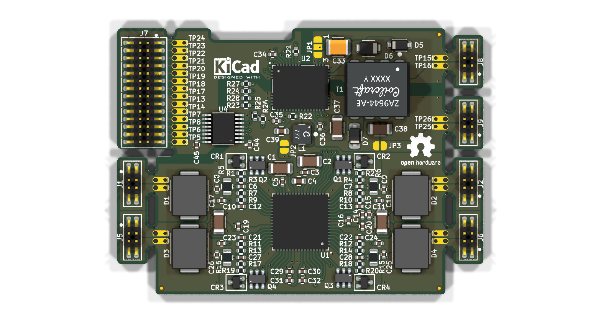
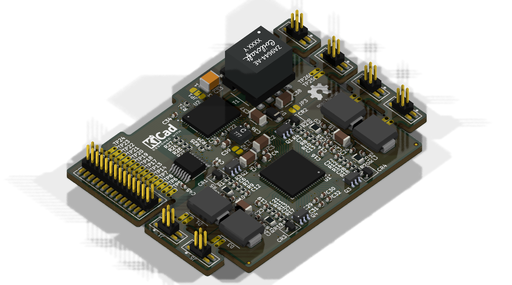
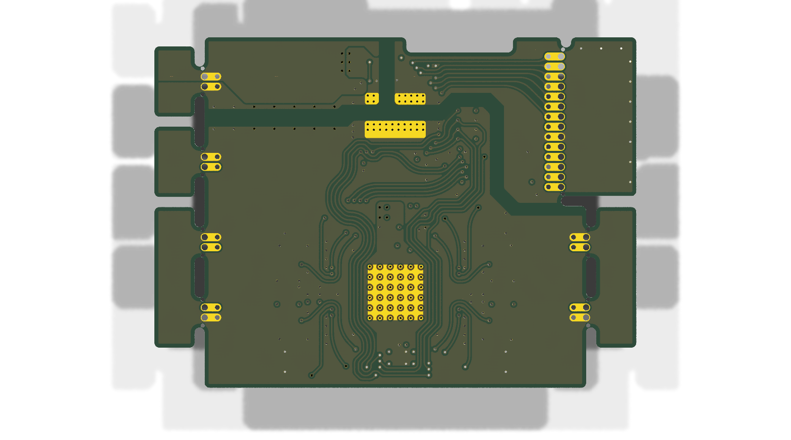

# Minimal_AD74413R

## Overview

This repository contains a minimal KiCad design project for the Analog Devices AD74413R, a quad-channel, software-configurable input and output device. The project includes schematic designs and PCB layout files for implementing this versatile analog I/O device.

## About the AD74413R

The AD74413R is a highly integrated, 16-bit, quad-channel, software-configurable input/output device designed for process control applications. Key features include:

- Quad-channel configurable analog I/O
- Software-selectable input/output modes:
  - 0 V to 10 V voltage output
  - 0 mA to 24 mA current output
  - 0 mA to 20 mA current output
  - ±10 V voltage input
  - 0 mA to 24 mA current input
  - Resistance measurement (RTD)
  - Digital input/output
- Integrated diagnostic features
- Compact 48-pin LFCSP package
- Integrated ADC and DAC functionality
- Configurable channel modes via SPI interface

## Project Structure

```
minimal_ad74413r/
├── minimal_ad74413r.kicad_sch       # Main schematic file
├── minimal_ad74413r.kicad_pcb       # PCB layout file
├── minimal_ad74413r.kicad_pro       # Project configuration file
├── fp-lib-table                     # Footprint library table
├── sym-lib-table                    # Symbol library table
├── Front End Channel 1.kicad_sch    # Channel-specific schematic
├── project_jobs_set.kicad_jobset    # Project job settings
├── ibom.config.ini                  # Interactive BOM configuration
├── docs/                            # Documentation files
│   ├── pictures/                    # Images and photos
│   ├── schematics/                  # Schematic PDF exports
│   └── 3d_models/                   # 3D model files
└── KiCAD_Symbols_Generator/         # Submodule for symbol generation from CSV data
```

## Features

This design provides a minimal implementation of the AD74413R with:

- Proper power supply connections (3.3V, AVDD, IOVDD)
- Basic channel configuration with protection circuits
- Standard footprint for the 48-pin LFCSP package
- Interactive HTML BOM support
- Comprehensive symbol library integration
- 3D model support for visualization

## Getting Started

### Prerequisites

- [KiCad EDA](https://www.kicad.org/) version 9.0 or later installed on your system
- Git (for cloning the repository and submodule management)

### Opening the Project

1. **Clone the repository** (including submodules):
   ```bash
   git clone --recursive https://github.com/ionutms/Minimal_AD74413R.git
   ```
   
   If you've already cloned the repository without submodules, initialize them with:
   ```bash
   git submodule init
   git submodule update
   ```

2. **Open the project in KiCad**:
   - Launch KiCad
   - Click "Open Existing Project"
   - Navigate to the cloned repository folder
   - Select the `minimal_ad74413r.kicad_pro` file

3. **Explore the design**:
   - Open the schematic editor to view the circuit design
   - Open the PCB editor to view the board layout
   - Review the symbol and footprint libraries used in the design

### Project Files

- **Main schematic**: `minimal_ad74413r.kicad_sch` - Contains the primary circuit design with the AD74413R and support components
- **Channel schematic**: `Front End Channel 1.kicad_sch` - Detailed implementation of one channel with protection and filtering
- **PCB layout**: `minimal_ad74413r.kicad_pcb` - Physical board design file with proper component placement
- **Project configuration**: `minimal_ad74413r.kicad_pro` - KiCad project settings

## Symbol and Footprint Libraries

This project uses a comprehensive set of custom symbol and footprint libraries organized by component type:

### Symbol Libraries (sym-lib-table):
- UNITED_IC_ADI - Contains the AD74413R symbol and other Analog Devices components
- UNITED_RESISTORS_DATA_BASE - Standard resistor symbols
- UNITED_CAPACITORS_DATA_BASE - Standard capacitor symbols
- And many others for different component types

### Footprint Libraries (fp-lib-table):
- analog_devices_footprints - Contains the 48-pin LFCSP footprint for AD74413R
- resistor_footprints - Standard resistor footprints (0402, 0603, etc.)
- capacitor_footprints - Standard capacitor footprints (0402, 0603, etc.)
- And many others for different component types

All libraries are provided through the KiCAD_Symbols_Generator submodule.

## Dependencies

This project has the following dependencies:

### 1. KiCAD Symbols Generator

This repository uses [KiCAD_Symbols_Generator](https://github.com/ionutms/KiCAD_Symbols_Generator) as a submodule for custom symbol generation.

To initialize the submodule after cloning this repository:

```bash
git submodule update --init --recursive
```

### 2. 3D Models

This project requires the [3D_Models_Vault](https://github.com/ionutms/3D_Models_Vault) repository for 3D models.

#### Setup for KiCAD 9:

1. Clone the 3D models repository:
   ```bash
   git clone https://github.com/ionutms/3D_Models_Vault.git
   ```

2. In KiCAD 9, add an environment variable:
   - Variable name: `KICAD9_3D_MODELS_VAULT`
   - Variable value: Full path to where you cloned the 3D_Models_Vault repository

## Usage

After setting up the dependencies, open the project in KiCad 9 to access all features including the 3D models.

## Symbol Generator Submodule

This project includes the KiCAD_Symbols_Generator as a submodule, which provides tools for generating KiCad symbols from CSV data files. For more information on using this tool, see the [KiCAD_Symbols_Generator documentation](minimal_ad74413r/KiCAD_Symbols_Generator/README.md).

## Documentation

The `docs` folder contains:
- Schematic PDF exports
- Images and photos of the design
- 3D model files (GLB and WRL formats)

## Visuals

The following images showcase the PCB design from different perspectives:


*Top View of the PCB*


*Side View of the PCB*


*Bottom View of the PCB*

## License

This project is licensed under the MIT License - see the [LICENSE](LICENSE) file for details.

## References

- [AD74413R Datasheet](https://www.analog.com/media/en/technical-documentation/data-sheets/ad74413r.pdf)
- [KiCad EDA](https://www.kicad.org/)